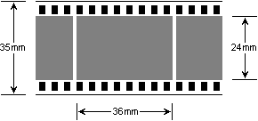
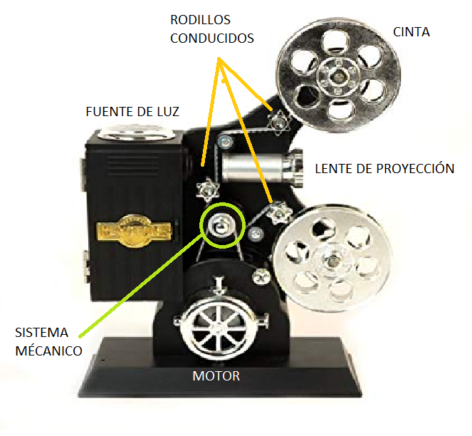

# 3.1.1 Guía

## PROYECTOR CINEMATOGRÁFICO

Un proyector de film es un dispositivo opto-mecánico que se utiliza para reproducir films\(películas\) proyectando imágenes a una pantalla. La maquina proyecta en intervalos de tiempo regulares un haz de luz sobre los fotogramas de una película, esta pelicula viene en un rollo y dependiendo del formato se pueden tener diferentes medidas para los fotogramas. 

El cinematógrafo fue patentado en febrero de 1894 por los hermanos Lumière y las primeras exhibiciones públicas se realizaron en 1895. En la actualidad existen "proyectores cinematográficos digitales" que proyectan una imagen generada por medios digitales, sin hacer uso de una película, pero sí del haz de luz y de las lentes.

De acuerdo con la teoría de la persistencia retiniana, el proceso perceptible del cerebro y la retina del ojo humano retiene una imagen durante un breve lapso de tiempo. Esta teoría explica como se percibe la ilusión del movimiento cuando una serie de imágenes se muestran en rápida sucesión, en lugar de percibir cada imagen individual de la serie.

Para la comprensión del fenómeno de la percepción visual se tiene que saber que el ojo no es una cámara, es decir, que no hay "imágenes por segundo" en el ojo. En lugar de eso, el sistema ojo/cerebro tiene una combinación de detectores de movimiento, detectores de detalle y detectores de patrones, cuyos resultados se combinan para crear la experiencia visual.

La frecuencia a la que el cambio de imágenes se vuelve invisible depende del nivel de iluminación. Generalmente, 16 imágenes por segundo  se considera la frecuencia más baja a la que el movimiento continuo es percibido por los humanos. 

Desde el nacimiento del cine sonoro, casi todos los proyectores de cine comerciales proyectan a una frecuencia de 24 imágenes por segundo. Esta velocidad se eligió por razones financieras y técnicas: era la frecuencia más baja \(por lo que requería menor cantidad de película\) a la que se podía realizar una reproducción y amplificación del sonido satisfactorias.

Para realizar las cintas se crearon diferentes métodos  hasta llegar a la fotografía digital tal y como la conocemos en la actualidad. Estos métodos son:

* 1816 - 1827. Heliografía 
* 1834 - 1839. Dibujos fotogénicos
* 1839 - 1860. Daguerrotipo
* 1841 - 1850. Calotipo / Talbotipo
* 1841 - 1850. Papel a la sal
* 1847 - 1857. Albúmina sobre vidrio
* 1850 - 1900. Papel a la albúmina
* 1851 - 1880. Colodión húmedo
* 1854 - 1860. Ambrotipo
* 1856 - 1920. Ferrotipo 
* 1860 - 1940. Papel al carbón
* 1878 -. Gelatino bromuro
* 1880 - 1920. Aristotipo al colodión
* 1880 - 1930. Papel al platino / Platinotipo
* 1880 - 1939. Cianotipo
* 1882 - 1930. Gelatina POP
* 1885 -. Gelatina DOP 
* 1890 - 1892. Goma bicromada 
* 1907 - 1935. Autocromos / Placa autocromática
* 1935 -. Revelado cromogénico
* 1946 -. Revelado por transferencia de tintes
* 1963 -. Procedimiento por difusión de tintes
* 1963 -. Revelado por blanqueo de tintes 
* 1981 -. Fotografía digital

"Los materiales utilizados para hacer la cinta o film son plata, ácido nítrico y gelatina. La base consiste en celulosa y solventes que se mezclan para formar un fluido espeso llamado dope. La película que se empaqueta en un casete \(la película de 35 milímetros generalmente se empaqueta de esta manera\) requiere un carrete de metal, el bote de metal protector y tiras de plástico en la abertura del bote donde emerge la película. El embalaje exterior también es aislante y protege la película de la exposición a la luz, el calor y el aire" . Para ver el proceso completo pueden acceder al link:



Las medidas utilizadas para un fotograma de un film de 35mm son las siguiente: 

Las partes generales de un proyector de film son las que se pueden observar en la siguiente imagen:

Para el funcionamiento de los lentes se utiliza un espejo cóncavo que invierta la luz producida por la lampara y la dirija al lente de condensación , este lente permite que la luz converja en un área especifica en este caso la dirige al fotograma de 35mm , la imagen pasa a través de una lente que se encarga de amplificarla. El sistema cuenta con un obturador que se encarga de controlar el tiempo en el que la imagen se proyecta de esta forma no se ve el desplazamiento entre fotogramas y la calidad de la imagen es mejor y mas agradable para el observador.

El sistema mecánico esta compuesto por uno o varios rodillos conducidos , dependiendo del modelo pueden haber mas de un rodillo conductor y un sistema basado en una transmisión por correa para el enrollado de la cinta. Debido a que se debe desplazar una distancia exacta\(la medida de un fotograma 36mm\) cada cierto periodo de tiempo\(24 fps=0.041 segundos para cada fotograma \) esto se hace utilizando un sistema mecánico conocido como cruz de malta.

Este sistema transforma un movimiento rotacional continuo a un movimiento rotacional pulsante o intermitente, de manera que los rodillos conductores están diseñados con unos pines que arrastran las perforaciones en la cinta y fueron diseñados para que 1/4 de vuelta del rodillo desplace la distancia de un fotograma, Lo que quiere decir que cada 4 vueltas del disco de freno son iguales a 1 vuelta del rodillo conductor\(contador intermitente\). 

