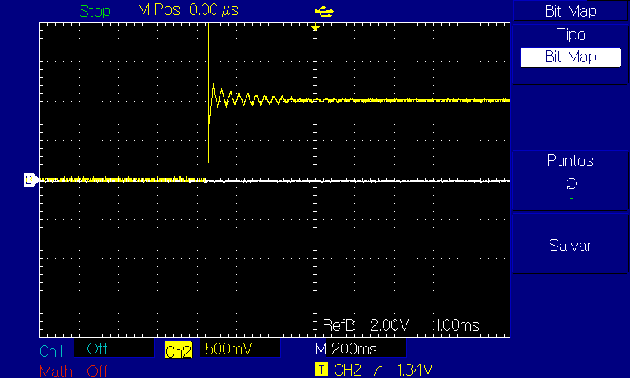
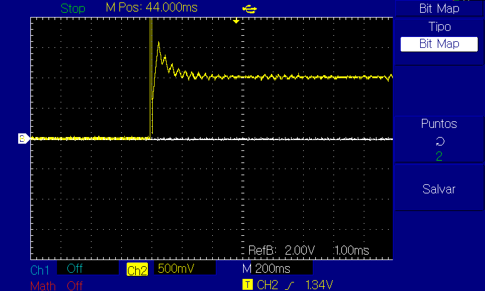

# El efecto de los retrasos de tiempo el algoritmos realimentados, tomando como caso particular el a

En los sistemas de control se han analizado diferentes algoritmos de control usando protocolos de red con retrasos constantes y variables. Sin embargo no existe una técnica para cualquier sistema de control debido que depende de la configuración de la red, el protocolo de comunicaciones, las aproximaciones que se hagan del sistema y el algoritmo de control.

En la mayoría de trabajos realizados sobre NCS\(Networked control system\) se analiza el desempeño del sistema considerando únicamente la estabilidad del lazo cerrado, este es un requisito indispensable para el sistema pero en muchos casos prácticos  los criterios de desempeño deseados en los sistemas de control se especifican en términos de la respuesta transitoria del sistema frente a una entrada especifica. Por lo que se propone analizar el efecto que genera el retraso sobre la respuesta transitoria del sistema.

La estructura del NCS que se va a presentar en este trabajo utiliza un ZOH \(retenedor de orden cero\) en la entrada de la planta. Los retrasos son generados por el envió de la información a través de la red entre medidor-controlador y controlador-actuador.

El NCS considerado presenta las siguientes suposiciones:

* Sistemas de control SISO\(Single Input, Single Output\)
* El sistema de control se encuentra sincronizado. En este caso la tarea que realiza la medición se activa periódicamente, y las tareas que realizan el calculo de la acción de control y actúan sobre el sistema se activan por eventos
* El retraso presente entre los instantes en que se inicia la medición y se finaliza la actuación es menor o igual a Ts
* Las tramas son transmitidas y recibidas libres de error

Entonces el sistema de control en lazo cerrado se representa de la siguiente forma:

Debido a que el sistema esta sincronizado se puede considerar los retrasos en el sistema como un solo retraso:

El retraso se puede modelar como $$ e^{-TrS}$$, con $$ T_r=(1-m)T_s$$. Donde $$ T_r$$ representa la suma de los retrasos entre medidor\_controlador y controlador-actuador y m es un valor que representa el porcentaje del tiempo de muestreo al que equivale el tiempo de retraso.

Empleando la transformada Z modificada es posible encontrar la función de transferencia en lazo cerrado del sistema entre 2 periodos de muestreo consecutivos, de lo cual se obtiene:

$$
H_{(Z,m)} = \frac {Gc_{(Z)}Gp'_{(Z,m)}}{1+Gc_{(Z)}Gp'_{(Z,m)}}
$$

Donde:

$$
Gp'_{(Z,m)} = (1-z^{-1})Z[\frac {Gp_{(s)}}{S}]
$$

$$
Gp'_{(Z,m)} = (1-z^{-1})[\sum residuo\_  de\_\frac {Gp_{(s)}}{S} \frac{(e^{mT_mS})z}{z-e^{T_mS}}\  en\_polo\_de\_Gp_{(s)} ]
$$

Para este caso donde se va a analizar un sistema de primer orden se tiene $$ Gp_{(s)}= \frac {K}{T_pS+1}$$;  por lo tanto:

$$
Gp'_{(Z,m)}=\frac KZ[1-\frac {e^{\frac {-mT_m}{T_p}}(z-1)}{z-e^{-\frac {T_m}{T_p}})}]
$$

Para este caso se caracterizo un motor DC el cual se aproximo a una planta de primer orden para los fines de esta practica.

La función de transferencia encontrada es la siguiente:

$$
Gp_{(s)}= \frac {0.97287}{0.083S+1}
$$

Se tuvo en cuenta un periodo de muestreo de 20 ms y un retraso de 3.3 ms debido a lo que tarda el micro controlador en enviar un dato float a 9600 baudrate conociendo que un float posee 32 bits.

$$
Gp'_{(Z,m)}=\frac {0.97287}{Z}[1-\frac {e^{{-(1-\frac{0.0033}{0.02})(\frac{0.02}{0.083})}}(z-1)}{z-e^{-\frac {0.02}{0.083}}}]
$$

Debido al orden del sistema con un algoritmo PI se puede realizar control a la planta  , este queda de la forma:

$$
U_{(z)}=\frac{k_pZ+(k_iT_m-k_p)}{z-1}E_{(z)}
$$

Se calcula el Ki y Kp para un tiempo de estabilización no mayor a 0.3 segundos y un sobrepico menor al 10%. Con lo cual se obtuvo kp=4.266 y ki=51.39. La respuesta del sistema discreto cuando no hay retraso es:

Y con el retraso propuesto de 3.33 segundos :

Se puede observar que el retraso producido en la comunicación es suficiente para producir que se incumpla la restricción para el sobre-pico.

Analizando un caso extremo donde el sistema tenga un retraso igual al tiempo de muestreo osea m=0, se observa la siguiente respuesta:

Se puede observar que el sistema presenta un sobre-pico mucho mas pronunciado y que tarda ,mas de 1 segundo en estabilizarse. Estos comportamientos no son permitidos al momento de implementar un proceso industrial. 

Se emuló el sistema haciendo uso de 2 arduinos Due , uno como planta discreta y el otro como controlador PI, apoyándose en las salidas y entradas digitales se montó el lazo de control y se observó el comportamiento del sistema en un osciloscopio digital. 

El sistema se comporta de una forma muy aproximada a la simulación que se hizo previamente, se puede evidenciar la importancia de tener en cuenta los retrasos en la comunicación como parámetro para el diseño de sistemas de control en plantas de respuesta rápida. 

Los Códigos en arduino y simulaciones en simulink se pueden encontrar en el siguiente link, tener en cuenta que para que funcione el archivo de simulink primero se debe correr el código de matlab que se llama región de estabilidad :

{% embed url="https://github.com/micros-uao/codigos/tree/master/Retrasos%20en%20sistemas%20de%20control" %}

