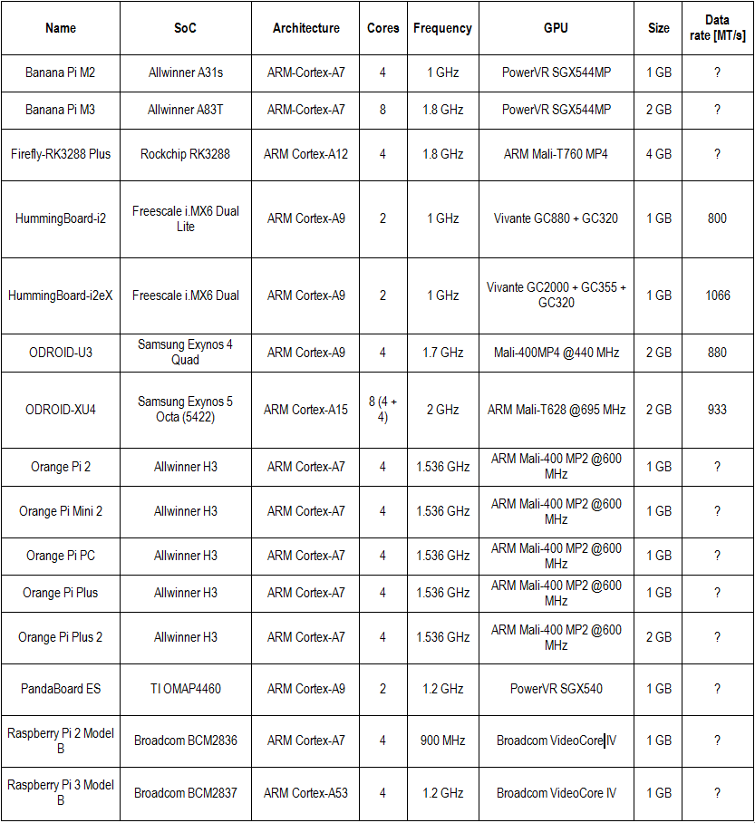
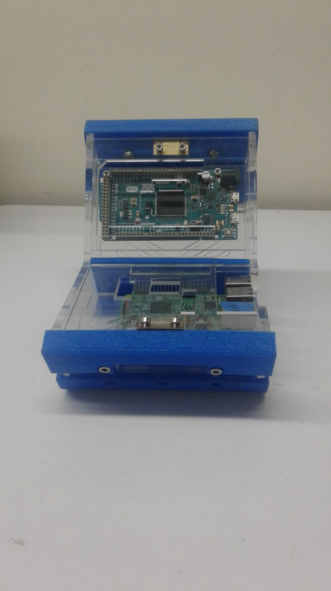
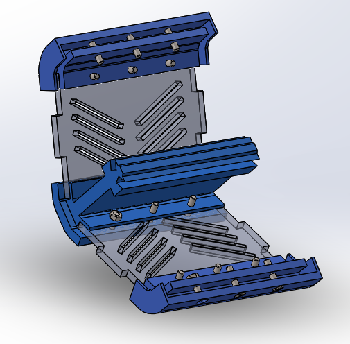
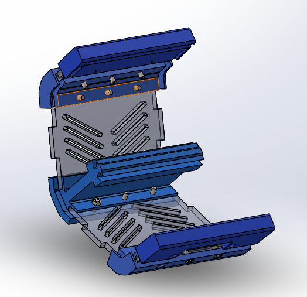
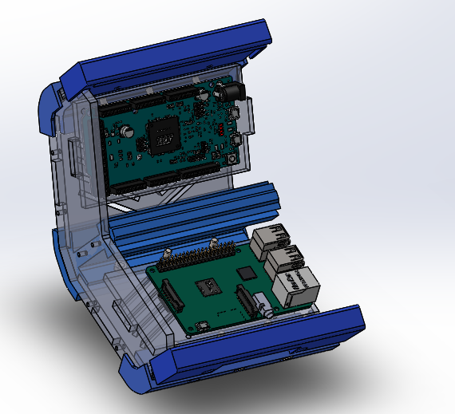
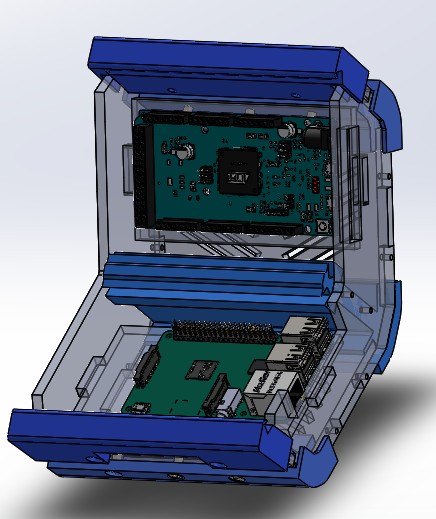
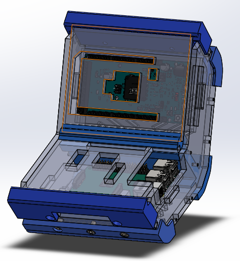

# 4.1 Planos plataforma

### Plataforma Tecnológica

Las características más relevantes en la selección de herramientas para el desarrollo de aplicaciones de DSP son:

* **Comunidad de usuarios y desarrolladores**, cantidad de recursos informáticos y de soporte para la tarjeta de desarrollo. Cantidad de proyectos que ya se han desarrollado con la misma.
* **Capacidad de procesamiento.** Entre mayor sea esta capacidad mayor será la gama de problemáticas que se puedan abordar con la tarjeta de desarrollo.
* **Periféricos**. Los proyectos desarrollados no solo involucran el desarrollo de software sino también de hardware. Esto implica que los sistemas embebidos que se utilicen tendrán que realizar interacciones directas con señales analógicas y digitales, por lo que es muy importante que la tarjeta de desarrollo que se seleccione cuente con las unidades básicas como puertos para entradas y salidas digitales, convertidores analógicos-digitales y digitales-analógicos, PLL, Temporizadores-Contadores, entradas de interrupción, etc.
* **Interfaces de comunicación**. Este factor impacta tanto la adquisición como el procesamiento de los datos. En muchas ocasiones la lectura de los sensores no se presenta de manera directa en forma analógica o digital, sino que es necesario hacer uso de algún protocolo de comunicación determinado para poder leer la información del mismo. Por otro lado, muchas veces es necesario comunicar entre si múltiples sistemas de procesamiento, ya sea por la ubicación de los sensores o porque se desea dividir las tareas en entre diferentes subsistemas. Una de las interfaces de comunicación más importantes es la relacionada con el acceso a internet \(sea cableada o no\) para poder desarrollar proyectos relacionados con IoT, que es una de las tendencias actuales en las aplicaciones.
* **Cantidad de núcleos**. Esta característica es muy importante para poder abordar la temática de la computación paralela. 
* **Arquitectura de procesador**. Este factor podría limitar el espectro de experimentos y problemáticas que se pueden abordar.
* **Costos**. Ya que estas tarjetas serán empleadas en actividades de b-Learning es necesario la adquisición de múltiples de herramientas por lo que el costo es un factor muy importante.
* **Robustez mecánica y eléctrica**. En las actividades de aprendizaje ocurre con frecuencia que se realizan conexiones equivocadas o los dispositivos se someten a estrés indebido. Es muy importante que los equipos seleccionados cuenten con las debidas protecciones para asegurar una vida útil aceptable.

Los requisitos técnicos considerados, ordenados de mayor a menor grado de importancia, se presentan a continuación 

La arquitectura propuesta para la plataforma se presenta a continuación:

Se presenta un análisis comparativo de plataformas comerciales de computadoras de placa reducida

Con base en los requisitos establecidos y las características de los entornos disponibles actualmente en el mercado se realizó la integración que se presenta a continuación.

Como computadora de placa reducida se seleccionó una Raspberry pi3, como microcontrolador un Cortex 3 implementado en la tarjeta Arduino DUE y como FPGA la Artix-7 35T de Xilinx. Además de los requisitos propuestos, estas plataformas soportan distintos protocolos de comunicaciones \(Ethernet, Bluetooth, Zigbee, CAN, SPI, I2C\) y periféricos para procesamiento de audio y video \(micrófono, parlante, cámara, pantallas\), entre otros; que facilitan el desarrollo de aplicaciones que involucren otras áreas \(como por ejemplo telecomunicaciones, control, informática, instrumentación, etc.\), contribuyendo en los procesos de aprendizaje a la integración de disciplinas y a los estudiantes a la integración de conocimientos a través de una misma plataforma. Lo cual no siempre se logra en los procesos en los que se tienen plataformas específicas para cada área que dificultan no solo el conocimiento de los diferentes entornos de desarrollo, sino también la integración de los conceptos por parte del estudiante en el abordaje de soluciones a problemas, los cuales cada vez más demandan este tipo de integraciones.

Para el  proceso de ensamblaje de la plataforma primero se debe imprimir 5 piezas en plástico o el material con el que se desee imprimir las piezas haciendo uso de las tecnologías de impresión 3D actuales, también se debe cortar algunas piezas en acrílico u otro material, importante tener en cuenta que el diseño se realizó con acrílico de 5.5 mm de espesor. Se procede a ensamblar , primero se unen las piezas que se muestran en la imagen y se utilizan tornillos y tuercas para fijarlas.

Después se procede a agregar los bordes de los extremos y se fijan con tornillos y tuercas igualmente.

Luego se pone la pieza lateral que se observa en la imagen y se disponen las 2 tarjetas que se muestran de la siguiente forma. 

El siguiente paso se aseguran las tarjetas haciendo uso de la pieza lateral derecha según la orientación que se viene manejando en las imágenes. Esto lo podemos observar en la siguiente imagen. 

Por ultimo se cubren las tarjetas insertando 2 piezas de acrílico en las ranuras que se pueden ver en los extremos del ensamble y en el centro del mismo, se dispone una pieza especifica para cada tarjeta. 

Las piezas en formato compatible con solidworks se encuentran en el siguiente link al repositorio.

{% embed url="https://github.com/micros-uao/codigos/tree/master/version%20para%20manufactura" %}

