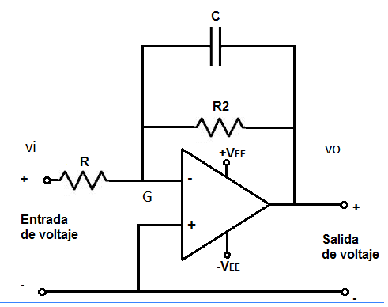

# 7. Filtro primer orden

Un filtro es un sistema que relaciona una señal de entrada con una señal de salida de acuerdo a la frecuencia de la señal de entrada.Los filtros se pueden clasificar en filtros analógicos y filtros digitales.

Entre los filtros analógicos se pueden encontrar filtros activos y pasivos.

* Los filtros pasivos son los que atenúan la señal y se implementan con condensadores , resistencias y  bobinas\(componentes pasivos\). 
* Los filtros activos son los pueden presentar una ganancia de la señal de salida con respecto a la señal de entrada. En su implementación se suelen usar amplificadores operacionales.

### Filtro Pasivo

Los filtros se pueden clasificar como pasa-banda , pasa-baja, pasa-alta, rechaza-banda. El siguiente ejemplo es un filtro pasa baja de orden 1:

Se plantea el sistemas de ecuaciones mediante las leyes de kirchhoff. La tensión en la resistencia 1 es:  

$$
\space Vi-Vo = iR_1 \ \ \ \ \ \ \ \ \ (1)
$$

Y la tensión en el capacitor es igual a :

$$
\space Vo =\frac 1C_1  \int idt \ \ \ \ \ \ \ \ \ (2)
$$

Se deriva la ecuación 2 , y se despeja la corriente:

$$
i= C1 \cfrac {dVo}{dt} \ \ \ \ \ \ \ \ \ (3)
$$

Se reemplaza la ecuación 3 en la ecuación 1 :

$$
Vi-Vo = R_1C_1\cfrac {dVo}{dt}  \ \ \ \ \ \ \ \ \ (4)
$$

En la ecuación 4 se aplica la transformada de Laplace y se despeja Vi:

$$
Vi = Vo(1+R_1C_1S) \ \ \ \ \ \ \ \ \ (5)
$$

La función del sistema es:

$$
\frac{Vo}{Vi} = \frac{1}{1+R_1C_1S}   \ \ \ \ \ \ \ \ \ (6)
$$

Las ventajas de este tipo de filtros es que mientras sean de pocos ordenes es una solución económica ademas de que son fáciles de implementar , su respuesta es muy aproximada a la función ideal, son muy utilizados en aplicaciones de alta frecuencia y potencia.

### Filtros activos

Un ejemplo de filtro pasa-bajas activo de primer orden se puede abordar desde 2 topologias , filtro inversor y no inversor.

#### Filtro inversor

Entre el pin inversor y el pin no inversor se tiene una resistencia muy alta pero la tensión es la misma en este caso sera la tierra del circuito, de esta forma se plantean las ecuaciones para cada componente de la siguiente manera:

$$
Vi = i_1*R_1  \ \ \ \ \ \ \ \ \ (7)\\ \space \\    Vo=-i_2*R_2 \ \ \ \ \ \ \ \ (8)\\ \space  \\ Vo =-\frac 1c  \int i_cdt  \ \ \ \ \ \ (9)
$$

Como se dijo previamente la resistencia entre los pines inversor y no inversor es tan grande que la corriente que fluye a tierra es aproximadamente cero, por lo que la corriente que fluye por R1 es igual a la suma de las corrientes que fluyen por R2 y C, entonces se plantea la siguiente ecuación :

$$
\ i_1 = i_2+i_c  \ \ \ \ \ \ \ \ \ (10)
$$

Se despeja i1, i2 e ic de las ecuaciones 7, 8 y 9 respectivamente. y se reemplazan en la ecuación 10:

$$
\frac {Vi}{R_1} =-c \frac{dVo}{dt}- \frac{Vo}{R_2}  \ \ \ \ \ \ \ \ \ (11)
$$

Se aplica la transformada de Laplace a la ecuación 11 y se despejan las variables hasta llegar a la ecuación del sistema:

$$
\frac{Vo}{Vi}=  \frac {-\frac{R_2}{R_1}}{1+CR_2S}  \ \ \ \ \ \ \ \ \ (12)
$$

#### Filtro no inversor

Para hallar la ecuación que modele el sistema se va a utilizar la ecuación 6, esto se puede hacer debido a que la tensión entre el pin inversor y el no inversor es la misma y que la corriente entre estos es aproximadamente cero. Entonces la ecuación 6 representa vf,  y se procede a realizar un divisor de tensión entre R2 y R1. De manera que las ecuaciones resultantes son:

$$
Vf= \frac {Vi}{1+RCS} \ \ \ \ \ \ \ \ \ (13) \\ \space\\  Vo= i(R_1+R_2)  \ \ \ \ \ \ \ \ \ (14) \\ \space \\  \ Vf=iR_1  \ \ \ \ \ \ \ \ \ (15)
$$

Se despeja la corriente de la ecuación 15  luego se reemplaza en la ecuación 14 y se despeja Vf:

$$
Vf= \frac{VoR_1}{(R_1+R_2)}  \ \ \ \ \ \ \ \ \ (16)
$$

Se reemplaza la ecuación 16 en la ecuación 13, después se procede a despejar Vo/Vi y de esta manera tener la ecuación que modela el sistema:

$$
\frac {Vo}{Vi}= \frac {1+\frac {R_2}{R_1}}{1+RCS}  \ \ \ \ \ \ \ \ \ (17)
$$

